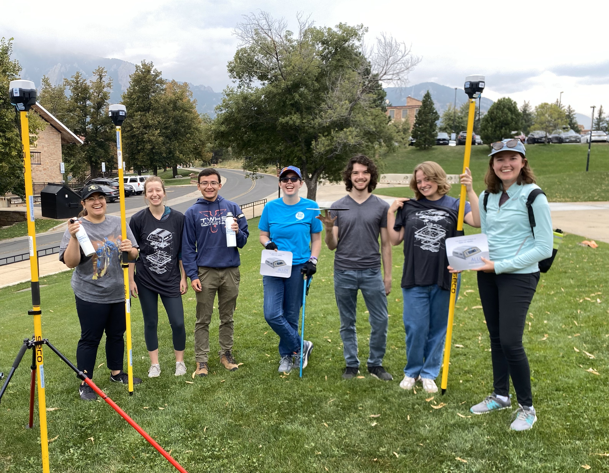
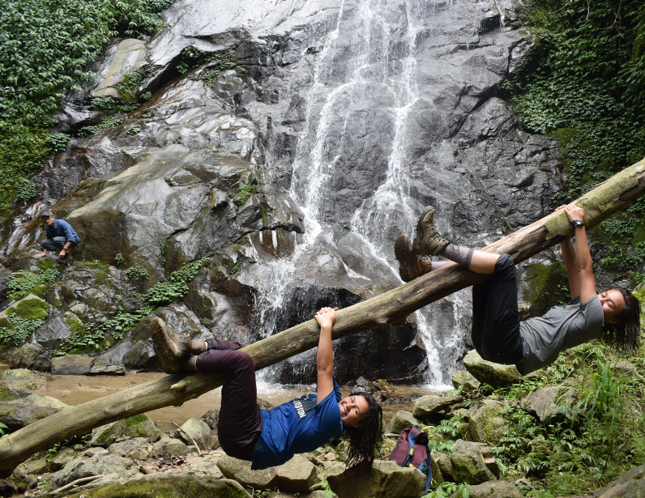
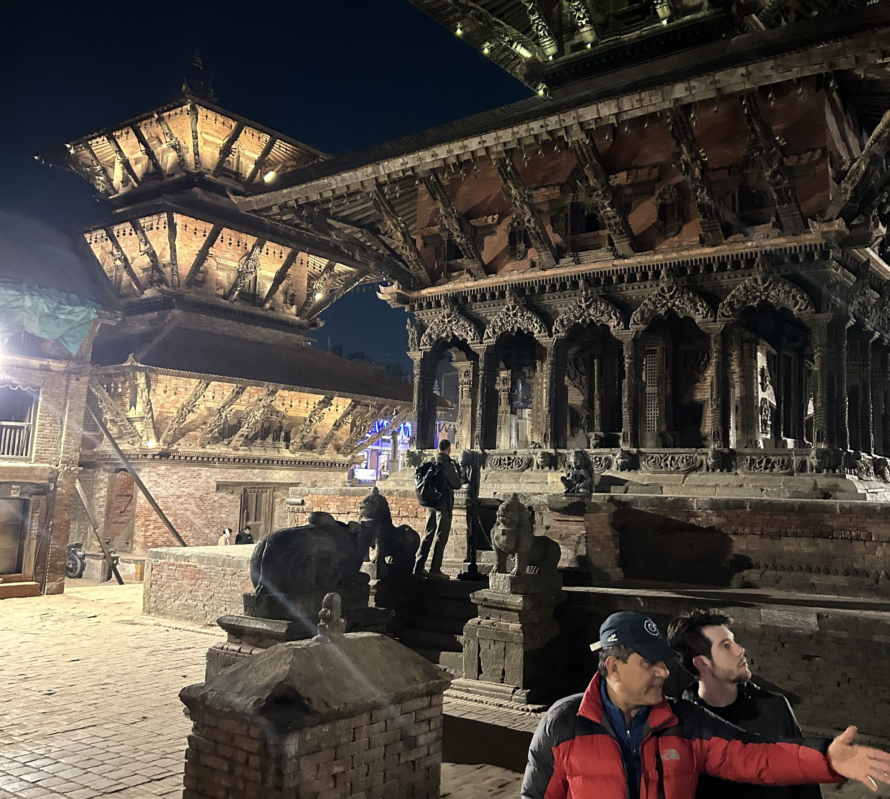

    
 

	<h2 class="section-heading text-uppercase">About</h2>

Since 2007, the EWB Nepal team has worked with a local Nepali NGO, the Namsaling Community Development Centre to design and implement water, sanitation, and hygiene engineering projects including water distribution systems and spring source protection projects in partnership with local communities. Our project is currently with the Hattitar village in the Ilam district of East Nepal to design and build a spring source protection project and water distribution system to deliver clean and reliable water to each household in the community. Our process includes rigorous professional engineering review and a thorough maintenance and evaluation of project functionality.

Students can get involved with the Nepal program by contributing to the design, sustainability, communications, or fundraising components of each project, whether it is spring source protection or establishing strong connections with our collaborators and future community.

In January of 2024, we established our first sister chapter partnership with EWB-Nepal Pulchowk campus! We are so excited to start working with them in our mission to strengthen international engineering communities.

**HOW TO JOIN**

If you are interested in joining our project, send us an email! You're welcome to stop by to meet us at any one of our meetings:

General Meetings: Thursdays 6:30-7:30pm @ ECCR 118
Design Meetings: TBD @ SEEC

We hope to see you on our team soon! 

**CONTACT US**

Feel free to reach us through our project email at <a href="mailto:{{ site.data.nepalteam.email }}">{{ site.data.nepalteam.email }}</a>!

Support our work in Nepal by checking out our <a href="https://support.ewb-usa.org/fundraiser/5418931">fundraising page</a>!