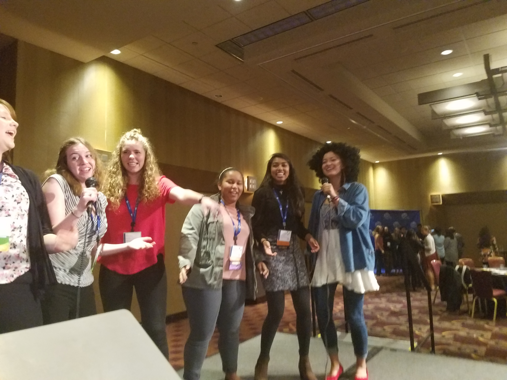
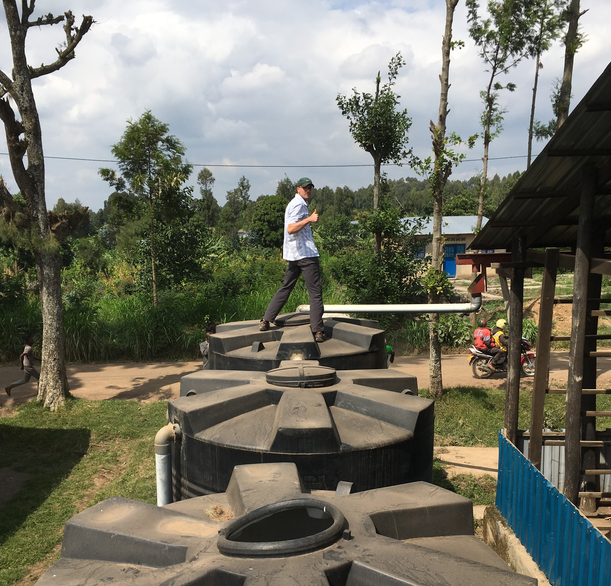
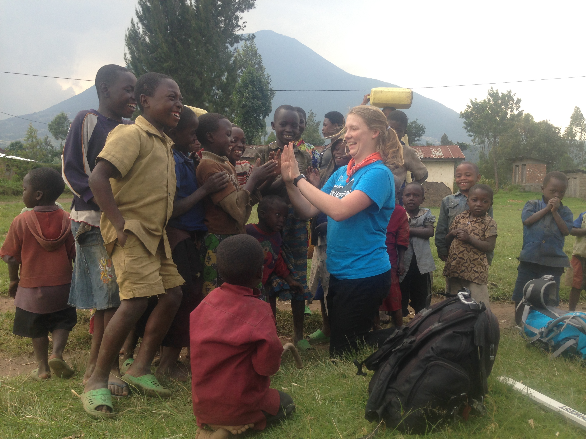

    
 

	<h2 class="section-heading text-uppercase">About</h2>

Our mission is to design and implement rainwater collection systems that provide the community members with sufficient water sources throughout the year. This water is not only affordable, but also easily accessible and cleaner than other water sources. Our first system was implemented in the summer of 2014, and we have since constructed seven systems in neighboring villages. These systems have been met with overwhelming support and gratitude from the community, and currently supply water for nearly 6,000 people.

We are excited to continue developing sustainable water catchment systems while learning to apply our engineering skills to meaningful projects. Our goal is not only to successfully build our structure, but also to continue to strengthen our relationship with the community members and to continue to serve their needs in future projects.

**HOW TO JOIN**

The Rwanda project currently meets Wednesdays 6:30-7:30pm in ECCR 118!

**CONTACT US**

For more information or if you have questions about the Rwanda project, please contact us by email at <a href="mailto:ewbcurwandapm@gmail.com">ewbcurwandapm@gmail.com</a>.